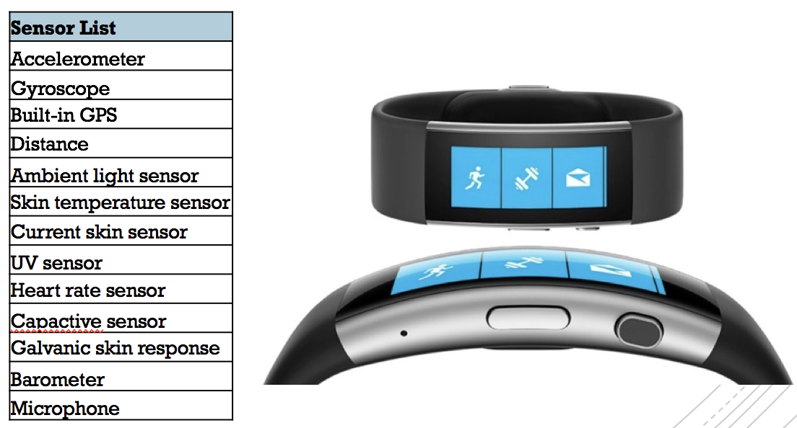
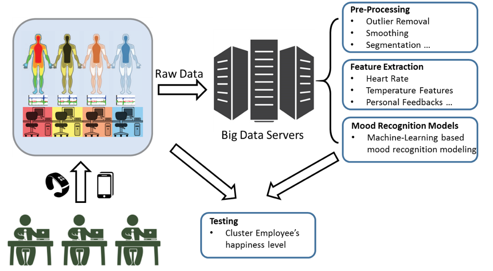

## Employee Happiness Project 

Funded by School of Computer Science and Engineering, Nanyang Technological University.

###Introduction

* Stress, anxiety, and depression in theworkplace are detrimental to employee health and productivity.  The lifeexpectancy of people in a stressful environment can be reduced by up to 3 years. 
* Theemployees who suffer from negative emotions havelower engagement and are less productive. 
* There is a growing need for understanding the overall happiness level of employees, tohelp improve occupational health, safety, well-being, and subsequentlyproductivity. 

### What the project will do

* To collect various real-time personalinformation and analysis the correlation between each factor and happinesslevel;
* To train employee happiness predictionmodels based on effective factors of employees; 
* To predict daily employee’s happinesslevel and derive harmonious and efficient working environment;
* To generate a employee’s happiness survey report

### Device

Microsoft Band 2 is the second generation of smart band which can incorporate fitness tracking by sensors and connect with iOS and Android smartphones via a Bluetooth connection.

### Experiment

### Android APP

The Android APP is designed to collect the physical data from MS Band and offer questionnaire to employees.

### Backend Sysyem

The backend system is builded by Node.js and is used to collect data from Android APP and store them in to MySQL database.